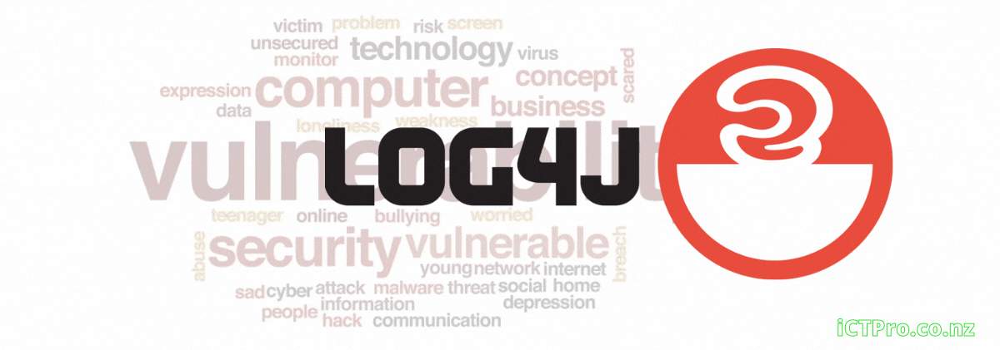

# How-to-check-log4j-CVE-2021-44228



### What is log4j ?
LOG4J is a open-source Java-based Apache Software used for logging services.

### What is log4j Vulnerability CVE-2021-44228 ?
The Log4j vulnerability allows remote code execution by simply typing a specific string into a textbox , works on every program using the Log4j library.


### Attack Surfaces / Related Softwares
| List of affected   | Related Links  |
| ------------ | ------------ |
|Brands |[YfryTchsGD github](https://github.com/YfryTchsGD/Log4jAttackSurface) link gives us a list of impacted services or components or manufacturers ( Apple, Tencent, Twitter, Cloudflare, Amazon, Tesla ...etc)|
| Softwares| Publised by Nationaal Cyber Security Centrum , [github link](https://github.com/NCSC-NL/log4shell/blob/main/software/README.md). (Adobe,EC2, AWS API gateway,DocumentDB, DynamoDB, Kafka, Kinesis, S3, SNS, SQS, AWS SSO, Apache Cisco, CYber ARk, Dell, FOrtinet,Fujitsu, IBM, JuniperNetworks, .......etc)


## How to check your server is vulnerabe or not?

There are heaps of metrails avilable on internet by now am adding few here.
make sure you read the resources before you use it.

I have writted a simple code to scan for log4j Vulnerability
## Quick Scan 
```wget https://raw.githubusercontent.com/anuvindhs/how-to-check-patch-secure-logj4-CVE-2021-44228/main/assets/scan.sh -q -O -| bash ```


| Source    | Related Links  |
| :------------: | ------------ |
||[Hotpatch](https://aws.amazon.com/blogs/opensource/hotpatch-for-apache-log4j/) for Apache Log4j</br> [AWS security services](https://aws.amazon.com/blogs/security/using-aws-security-services-to-protect-against-detect-and-respond-to-the-log4j-vulnerability/) to protect against, detect, and respond to the Log4j vulnerability</br> [Mitigating the Apache log4j security issue ](https://aws.amazon.com/blogs/containers/advice-on-mitigating-the-apache-log4j-security-issue-for-eks-ecs-and-fargate-customers/) for EKS, ECS, and Fargate customers|
||[ Guidance for preventing, detecting, and hunting for exploitation of the Log4j 2 vulnerability](https://www.microsoft.com/security/blog/2021/12/11/guidance-for-preventing-detecting-and-hunting-for-cve-2021-44228-log4j-2-exploitation)| 
||i have written a simple bash script to do a basic quick scan.<br /> [Inspect Code](https://raw.githubusercontent.com/anuvindhs/how-to-check-patch-secure-logj4-CVE-2021-44228/main/assets/scan.sh)<br /> [Copy code](#quick-scan)
||Check your Server for the Java Log4j Vulnerability , <br />[Blog link](https://www.clusterednetworks.com/blog/post/how-check-your-server-java-log4j-vulnerability "Clustered network") , [Youtube Tutorial](https://youtu.be/9sXASvVu9L8) , [github link](https://github.com/rubo77/log4j_checker_beta)|
|  | <br />[Website Link](https://log4j-tester.trendmicro.com/), It comes with a web based tool to identify the affected servers CVE-2021-44228|
| | Performs two specific checks: HTTP headers and HTTP GET request, [github link](https://github.com/rubo77/log4j_checker_beta)  |
|  |log4j PowerShell Checker [github Link](https://github.com/crypt0jan/log4j-powershell-checker)|
||A fully automated, accurate, and extensive scanner for finding vulnerable log4j hosts, [github link](https://github.com/fullhunt/log4j-scan)|
|[ADIL SOYBALI](https://adilsoybali.com/#home)|Log4j-RCE-Scanner,scan for remote command execution vulnerability CVE-2021-44228 on Apache Log4j at multiple addresses.[github link](https://github.com/adilsoybali/Log4j-RCE-Scanner)|
||Bytecode Detector,scans all running java processes for vulnerable log4j files. It is NOT invasive and DOES NOT require you to stop your application. It also check, if the program includes artifacts that re-bundled or re-compiled the vulnerable log4j JARs [github link](https://github.com/CodeShield-Security/Log4JShell-Bytecode-Detector)|
||Log4j Quick [Reference Guide (QRG)](https://www.crowdstrike.com/blog/crowdstrike-services-launches-log4j-quick-reference-guide)</br> Live Log4J [Worldwide threat tracker](https://crowdsec.net/log4j-tracker/)</br>  Free Targeted Log4j [Search Tool](https://www.crowdstrike.com/blog/free-targeted-log4j-search-tool/)|


## Lab Environments
| Created by   |Lab Environment  |
| :------------: | ------------ |
| & [JohnHammond](https://tryhackme.com/p/JohnHammond)|[Solar, exploiting log4j](https://tryhackme.com/room/solar) </br> |
||[Log4j RCE](https://pentesterlab.com/exercises/log4j_rce/course),This challenge covers the latest RCE in Log4j|
||Review the Log4J (also known as the Log4Shell) vulnerability, its use in networks currently, and demo the [exploit in a sandboxed environment](https://ine.com/learning/courses/log4j-vulnerability-log4shell)


  ** Will update more information on coming days ...


